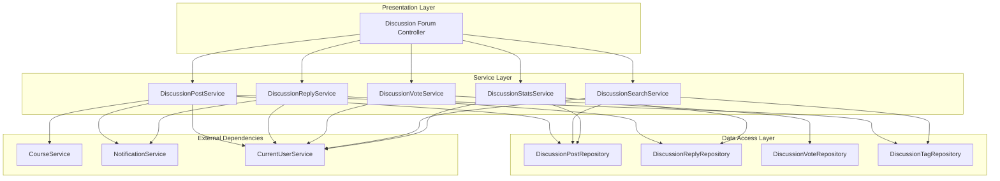
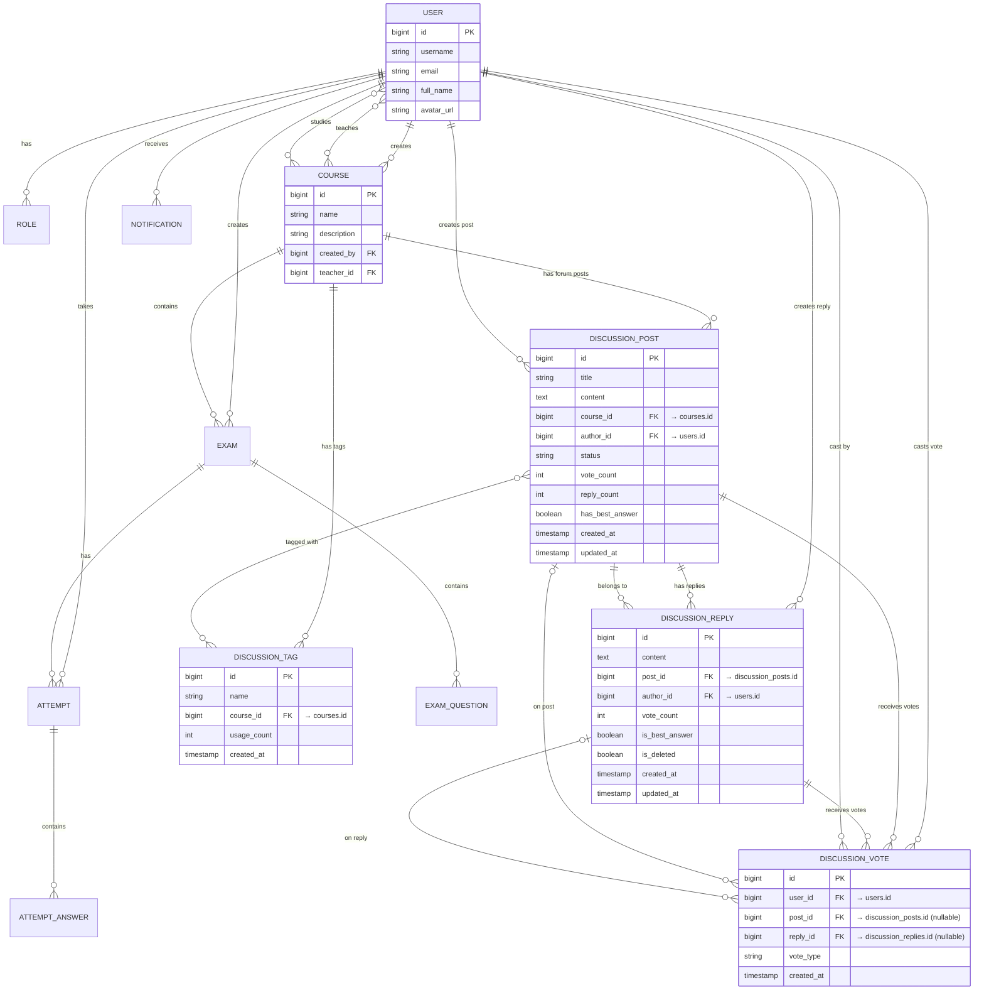

# Technical Design Document - Discussion/Q&A Forum

## Overview

### Purpose
The Discussion/Q&A Forum feature enables course members (teachers and students) to interact, ask questions, and engage in discussions within the scope of individual courses. This feature enhances learning through knowledge sharing and collaborative problem-solving.

### Scope
This design covers:
- Discussion post creation, editing, and deletion
- Reply management with best answer marking
- Voting system for posts and replies
- Tag-based categorization
- Search and filtering capabilities
- Notification system for forum activities
- Forum statistics for teachers

### Key Design Principles
1. **Isolation**: Forum functionality is completely independent from existing exam/course logic
2. **Security**: Access control enforced at service layer - only course members can access forum content
3. **Consistency**: Follows existing patterns in the codebase (BaseEntity, service layer architecture, DTO mapping)
4. **Scalability**: Designed to handle high-volume discussions with proper indexing

### Integration Points
- **Course Entity**: Forum posts are scoped to courses via foreign key relationship
- **User Entity**: Authors and voters reference existing User entity
- **Notification System**: Leverages existing Notification entity for forum events
- **Security**: Uses existing CurrentUserService for authentication and authorization

## Architecture

### High-Level Architecture



### Package Structure

```
com.example.online_exam.discussion/
├── controller/
│   └── DiscussionForumController.java
├── dto/
│   ├── DiscussionPostRequest.java
│   ├── DiscussionPostResponse.java
│   ├── DiscussionReplyRequest.java
│   ├── DiscussionReplyResponse.java
│   ├── DiscussionVoteRequest.java
│   ├── DiscussionSearchRequest.java
│   └── ForumStatsResponse.java
├── entity/
│   ├── DiscussionPost.java
│   ├── DiscussionReply.java
│   ├── DiscussionVote.java
│   └── DiscussionTag.java
├── enums/
│   ├── VoteType.java
│   └── PostStatus.java
├── mapper/
│   ├── DiscussionPostMapper.java
│   └── DiscussionReplyMapper.java
├── repository/
│   ├── DiscussionPostRepository.java
│   ├── DiscussionReplyRepository.java
│   ├── DiscussionVoteRepository.java
│   └── DiscussionTagRepository.java
└── service/
    ├── DiscussionPostService.java
    ├── DiscussionReplyService.java
    ├── DiscussionVoteService.java
    ├── DiscussionSearchService.java
    └── DiscussionStatsService.java
```

### Layer Responsibilities

**Controller Layer**
- HTTP request/response handling
- Input validation (via @Valid annotations)
- Route definition and API documentation
- Delegates business logic to service layer

**Service Layer**
- Business logic implementation
- Authorization checks (course membership validation)
- Transaction management
- Coordination between repositories
- Notification triggering

**Repository Layer**
- Data access operations
- Custom query methods
- JPA entity management

**Mapper Layer**
- Entity ↔ DTO conversion
- Data transformation logic

## Components and Interfaces

### Core Entities

#### DiscussionPost Entity
```java
@Entity
@Table(name = "discussion_posts", indexes = {
    @Index(name = "idx_post_course", columnList = "course_id"),
    @Index(name = "idx_post_author", columnList = "author_id"),
    @Index(name = "idx_post_status", columnList = "status"),
    @Index(name = "idx_post_created", columnList = "created_at"),
    @Index(name = "idx_post_votes", columnList = "vote_count")
})
public class DiscussionPost extends BaseEntity {
    @Column(nullable = false, length = 200)
    private String title;
    
    @Column(nullable = false, columnDefinition = "TEXT")
    private String content;
    
    @ManyToOne(fetch = FetchType.LAZY)
    @JoinColumn(name = "course_id", nullable = false)
    private Course course;
    
    @ManyToOne(fetch = FetchType.LAZY)
    @JoinColumn(name = "author_id", nullable = false)
    private User author;
    
    @Enumerated(EnumType.STRING)
    @Column(nullable = false)
    private PostStatus status = PostStatus.ACTIVE;
    
    private Integer voteCount = 0;
    private Integer replyCount = 0;
    private Boolean hasBestAnswer = false;
    
    @ManyToMany
    @JoinTable(
        name = "discussion_post_tags",
        joinColumns = @JoinColumn(name = "post_id"),
        inverseJoinColumns = @JoinColumn(name = "tag_id")
    )
    private Set<DiscussionTag> tags = new HashSet<>();
    
    @OneToMany(mappedBy = "post", cascade = CascadeType.ALL)
    private List<DiscussionReply> replies = new ArrayList<>();
}
```

#### DiscussionReply Entity
```java
@Entity
@Table(name = "discussion_replies", indexes = {
    @Index(name = "idx_reply_post", columnList = "post_id"),
    @Index(name = "idx_reply_author", columnList = "author_id"),
    @Index(name = "idx_reply_created", columnList = "created_at"),
    @Index(name = "idx_reply_votes", columnList = "vote_count"),
    @Index(name = "idx_reply_best", columnList = "is_best_answer")
})
public class DiscussionReply extends BaseEntity {
    @Column(nullable = false, columnDefinition = "TEXT")
    private String content;
    
    @ManyToOne(fetch = FetchType.LAZY)
    @JoinColumn(name = "post_id", nullable = false)
    private DiscussionPost post;
    
    @ManyToOne(fetch = FetchType.LAZY)
    @JoinColumn(name = "author_id", nullable = false)
    private User author;
    
    private Integer voteCount = 0;
    private Boolean isBestAnswer = false;
    private Boolean isDeleted = false;
}
```

#### DiscussionVote Entity
```java
@Entity
@Table(name = "discussion_votes", 
    uniqueConstraints = {
        @UniqueConstraint(columnNames = {"user_id", "post_id"}),
        @UniqueConstraint(columnNames = {"user_id", "reply_id"})
    },
    indexes = {
        @Index(name = "idx_vote_user", columnList = "user_id"),
        @Index(name = "idx_vote_post", columnList = "post_id"),
        @Index(name = "idx_vote_reply", columnList = "reply_id")
    }
)
public class DiscussionVote extends BaseEntity {
    @ManyToOne(fetch = FetchType.LAZY)
    @JoinColumn(name = "user_id", nullable = false)
    private User user;
    
    @ManyToOne(fetch = FetchType.LAZY)
    @JoinColumn(name = "post_id")
    private DiscussionPost post;
    
    @ManyToOne(fetch = FetchType.LAZY)
    @JoinColumn(name = "reply_id")
    private DiscussionReply reply;
    
    @Enumerated(EnumType.STRING)
    @Column(nullable = false)
    private VoteType voteType; // UPVOTE, DOWNVOTE
}
```

#### DiscussionTag Entity
```java
@Entity
@Table(name = "discussion_tags",
    uniqueConstraints = {
        @UniqueConstraint(columnNames = {"course_id", "name"})
    },
    indexes = {
        @Index(name = "idx_tag_course", columnList = "course_id"),
        @Index(name = "idx_tag_name", columnList = "name")
    }
)
public class DiscussionTag extends BaseEntity {
    @Column(nullable = false, length = 30)
    private String name;
    
    @ManyToOne(fetch = FetchType.LAZY)
    @JoinColumn(name = "course_id", nullable = false)
    private Course course;
    
    private Integer usageCount = 0;
}
```

### Service Interfaces

#### DiscussionPostService
```java
public interface DiscussionPostService {
    DiscussionPostResponse createPost(DiscussionPostRequest request);
    DiscussionPostResponse getPostById(Long postId);
    Page<DiscussionPostResponse> getPostsByCourse(Long courseId, Pageable pageable);
    DiscussionPostResponse updatePost(Long postId, DiscussionPostRequest request);
    void deletePost(Long postId);
    DiscussionPostResponse markBestAnswer(Long postId, Long replyId);
}
```

#### DiscussionReplyService
```java
public interface DiscussionReplyService {
    DiscussionReplyResponse createReply(Long postId, DiscussionReplyRequest request);
    DiscussionReplyResponse updateReply(Long replyId, DiscussionReplyRequest request);
    void deleteReply(Long replyId);
    List<DiscussionReplyResponse> getRepliesByPost(Long postId);
}
```

#### DiscussionVoteService
```java
public interface DiscussionVoteService {
    void votePost(Long postId, VoteType voteType);
    void voteReply(Long replyId, VoteType voteType);
    void removeVoteFromPost(Long postId);
    void removeVoteFromReply(Long replyId);
}
```

#### DiscussionSearchService
```java
public interface DiscussionSearchService {
    Page<DiscussionPostResponse> searchPosts(DiscussionSearchRequest request, Pageable pageable);
}
```

#### DiscussionStatsService
```java
public interface DiscussionStatsService {
    ForumStatsResponse getCourseForumStats(Long courseId);
}
```

### REST API Endpoints

```
POST   /api/courses/{courseId}/discussions              - Create post
GET    /api/courses/{courseId}/discussions              - List posts (paginated)
GET    /api/discussions/{postId}                        - Get post detail
PUT    /api/discussions/{postId}                        - Update post
DELETE /api/discussions/{postId}                        - Delete post

POST   /api/discussions/{postId}/replies                - Create reply
PUT    /api/discussions/replies/{replyId}               - Update reply
DELETE /api/discussions/replies/{replyId}               - Delete reply

POST   /api/discussions/{postId}/vote                   - Vote on post
DELETE /api/discussions/{postId}/vote                   - Remove vote from post
POST   /api/discussions/replies/{replyId}/vote          - Vote on reply
DELETE /api/discussions/replies/{replyId}/vote          - Remove vote from reply

POST   /api/discussions/{postId}/best-answer/{replyId}  - Mark best answer

GET    /api/courses/{courseId}/discussions/search       - Search/filter posts
GET    /api/courses/{courseId}/discussions/stats        - Forum statistics (teachers only)
```

## Data Models

### Entity Relationships (Complete System View)



### Integration Summary

**Forum integrates with existing system through:**

1. **courses table** - Each discussion post belongs to a course
   - FK: `discussion_posts.course_id → courses.id`
   - Enables course-scoped forums
   - Reuses existing course membership logic

2. **users table** - All forum content is authored by users
   - FK: `discussion_posts.author_id → users.id`
   - FK: `discussion_replies.author_id → users.id`
   - FK: `discussion_votes.user_id → users.id`
   - Reuses existing user authentication and profiles

3. **notifications table** (existing) - Forum events trigger notifications
   - Reply notifications
   - Best answer notifications
   - Reuses existing notification infrastructure

**No modifications to existing tables** - All new functionality is contained in new tables with foreign key references only.

### Database Schema

**discussion_posts**
- id (PK, BIGINT, AUTO_INCREMENT)
- title (VARCHAR(200), NOT NULL)
- content (TEXT, NOT NULL)
- course_id (FK → courses.id, NOT NULL)
- author_id (FK → users.id, NOT NULL)
- status (VARCHAR(20), NOT NULL, DEFAULT 'ACTIVE')
- vote_count (INT, DEFAULT 0)
- reply_count (INT, DEFAULT 0)
- has_best_answer (BOOLEAN, DEFAULT FALSE)
- created_at (TIMESTAMP)
- updated_at (TIMESTAMP)

**discussion_replies**
- id (PK, BIGINT, AUTO_INCREMENT)
- content (TEXT, NOT NULL)
- post_id (FK → discussion_posts.id, NOT NULL)
- author_id (FK → users.id, NOT NULL)
- vote_count (INT, DEFAULT 0)
- is_best_answer (BOOLEAN, DEFAULT FALSE)
- is_deleted (BOOLEAN, DEFAULT FALSE)
- created_at (TIMESTAMP)
- updated_at (TIMESTAMP)

**discussion_votes**
- id (PK, BIGINT, AUTO_INCREMENT)
- user_id (FK → users.id, NOT NULL)
- post_id (FK → discussion_posts.id, NULL)
- reply_id (FK → discussion_replies.id, NULL)
- vote_type (VARCHAR(10), NOT NULL) -- 'UPVOTE' or 'DOWNVOTE'
- created_at (TIMESTAMP)
- updated_at (TIMESTAMP)
- UNIQUE(user_id, post_id)
- UNIQUE(user_id, reply_id)
- CHECK: (post_id IS NOT NULL AND reply_id IS NULL) OR (post_id IS NULL AND reply_id IS NOT NULL)

**discussion_tags**
- id (PK, BIGINT, AUTO_INCREMENT)
- name (VARCHAR(30), NOT NULL)
- course_id (FK → courses.id, NOT NULL)
- usage_count (INT, DEFAULT 0)
- created_at (TIMESTAMP)
- updated_at (TIMESTAMP)
- UNIQUE(course_id, name)

**discussion_post_tags** (join table)
- post_id (FK → discussion_posts.id)
- tag_id (FK → discussion_tags.id)
- PRIMARY KEY(post_id, tag_id)

### DTO Structures

**DiscussionPostRequest**
```java
{
    "title": "string (10-200 chars)",
    "content": "string (20-10000 chars)",
    "courseId": "long",
    "tags": ["string (2-30 chars)"] // 0-5 tags
}
```

**DiscussionPostResponse**
```java
{
    "id": "long",
    "title": "string",
    "content": "string",
    "courseId": "long",
    "courseName": "string",
    "author": {
        "id": "long",
        "username": "string",
        "fullName": "string"
    },
    "status": "string",
    "voteCount": "int",
    "replyCount": "int",
    "hasBestAnswer": "boolean",
    "tags": ["string"],
    "currentUserVote": "string", // null, "UPVOTE", "DOWNVOTE"
    "createdAt": "timestamp",
    "updatedAt": "timestamp"
}
```

**DiscussionReplyRequest**
```java
{
    "content": "string (10-5000 chars)"
}
```

**DiscussionReplyResponse**
```java
{
    "id": "long",
    "content": "string",
    "postId": "long",
    "author": {
        "id": "long",
        "username": "string",
        "fullName": "string"
    },
    "voteCount": "int",
    "isBestAnswer": "boolean",
    "currentUserVote": "string", // null, "UPVOTE", "DOWNVOTE"
    "createdAt": "timestamp",
    "updatedAt": "timestamp"
}
```

**DiscussionSearchRequest**
```java
{
    "courseId": "long",
    "keyword": "string (optional)",
    "tags": ["string"] (optional),
    "hasAnswer": "boolean (optional)",
    "sortBy": "string (optional)" // "date", "votes", "replies"
}
```

**ForumStatsResponse**
```java
{
    "totalPosts": "int",
    "totalReplies": "int",
    "answeredPosts": "int",
    "mostActiveStudents": [
        {
            "userId": "long",
            "username": "string",
            "fullName": "string",
            "postCount": "int",
            "replyCount": "int"
        }
    ],
    "popularTags": [
        {
            "name": "string",
            "usageCount": "int"
        }
    ]
}
```


## Correctness Properties

*A property is a characteristic or behavior that should hold true across all valid executions of a system—essentially, a formal statement about what the system should do. Properties serve as the bridge between human-readable specifications and machine-verifiable correctness guarantees.*

### Property Reflection

After analyzing all acceptance criteria, I identified the following redundancies:
- Requirements 1.3 is covered by 1.2 (both test non-member rejection for post creation)
- Requirements 2.3 is covered by 2.2 (both test non-member rejection for reply creation)
- Requirements 3.1 and 3.2 can be combined (both test marking best answer, just different authorized roles)
- Requirements 4.1 and 4.2 can be combined into a single vote count property
- Requirements 4.3 and 4.4 can be combined into a vote change property
- Requirements 10.1 and 10.2 can be combined (both test post updates by authorized users)
- Requirements 10.3 and 10.4 can be combined (both test post deletion by authorized users)
- Requirements 11.1 and 11.2 can be combined (both test reply updates by authorized users)
- Requirements 11.3 and 11.4 can be combined (both test reply deletion by authorized users)

### Property 1: Post Creation Persistence

*For any* valid discussion post with title (10-200 chars), content (20-10000 chars), course reference, and author who is a course member, creating the post SHALL result in a persisted entity with all fields preserved, voteCount initialized to 0, replyCount initialized to 0, and hasBestAnswer set to false.

**Validates: Requirements 1.1, 1.4**

### Property 2: Course Membership Authorization for Post Creation

*For any* user and course, the user SHALL be able to create a discussion post in that course if and only if the user is a member (teacher or student) of that course.

**Validates: Requirements 1.2, 1.3**

### Property 3: Post Title Length Validation

*For any* post creation request, the system SHALL accept titles with length between 10 and 200 characters (inclusive) and SHALL reject titles with length less than 10 or greater than 200 characters.

**Validates: Requirements 1.5**

### Property 4: Post Content Length Validation

*For any* post creation request, the system SHALL accept content with length between 20 and 10000 characters (inclusive) and SHALL reject content with length less than 20 or greater than 10000 characters.

**Validates: Requirements 1.6**

### Property 5: Reply Creation Persistence

*For any* valid reply with content (10-5000 chars), parent post reference, and author who is a member of the post's course, creating the reply SHALL result in a persisted entity with all fields preserved and voteCount initialized to 0.

**Validates: Requirements 2.1, 2.4**

### Property 6: Course Membership Authorization for Reply Creation

*For any* user and discussion post, the user SHALL be able to create a reply to that post if and only if the user is a member of the course containing the post.

**Validates: Requirements 2.2, 2.3**

### Property 7: Reply Count Increment

*For any* discussion post, when N replies are created for that post, the post's replyCount SHALL equal N.

**Validates: Requirements 2.6**

### Property 8: Reply Content Length Validation

*For any* reply creation request, the system SHALL accept content with length between 10 and 5000 characters (inclusive) and SHALL reject content with length less than 10 or greater than 5000 characters.

**Validates: Requirements 2.5**

### Property 9: Best Answer Marking Authorization

*For any* discussion post and reply, a user SHALL be able to mark that reply as the best answer if and only if the user is either the post author or a teacher of the course containing the post.

**Validates: Requirements 3.1, 3.2, 3.4**

### Property 10: Single Best Answer Constraint

*For any* discussion post, when a reply is marked as best answer, that reply SHALL have isBestAnswer = true, all other replies SHALL have isBestAnswer = false, and the post SHALL have hasBestAnswer = true.

**Validates: Requirements 3.3, 3.5**

### Property 11: Vote Count Changes

*For any* discussion post or reply with initial voteCount V:
- Creating an upvote SHALL result in voteCount = V + 1
- Creating a downvote SHALL result in voteCount = V - 1
- Changing from upvote to downvote SHALL result in voteCount = V - 2
- Changing from downvote to upvote SHALL result in voteCount = V + 2
- Removing an upvote SHALL result in voteCount = V - 1
- Removing a downvote SHALL result in voteCount = V + 1

**Validates: Requirements 4.1, 4.2, 4.3, 4.4, 4.5**

### Property 12: One Vote Per User Constraint

*For any* user and discussion post (or reply), the user SHALL be able to have at most one vote on that post (or reply) at any given time.

**Validates: Requirements 4.6**

### Property 13: Course Membership Authorization for Voting

*For any* user and discussion post or reply, the user SHALL be able to vote on that post or reply if and only if the user is a member of the course containing the post.

**Validates: Requirements 4.7**

### Property 14: Tag Association Persistence

*For any* discussion post created with a set of tags T (where |T| ≤ 5), retrieving that post SHALL return the same set of tags T.

**Validates: Requirements 5.1**

### Property 15: Tag Count Constraint

*For any* discussion post creation or update request, the system SHALL accept 0 to 5 tags (inclusive) and SHALL reject requests with more than 5 tags.

**Validates: Requirements 5.2**

### Property 16: Tag Name Length Validation

*For any* tag, the system SHALL accept tag names with length between 2 and 30 characters (inclusive) and SHALL reject tag names with length less than 2 or greater than 30 characters.

**Validates: Requirements 5.3**

### Property 17: Tag Replacement on Update

*For any* discussion post with initial tags T1, when the post is updated with new tags T2, retrieving the post SHALL return only tags T2 (T1 is completely replaced).

**Validates: Requirements 5.4**

### Property 18: Tag Name Normalization

*For any* tag name with mixed case characters, the system SHALL store and return that tag name in lowercase format.

**Validates: Requirements 5.5**

### Property 19: Tag Creation on First Use

*For any* tag name that has not been used in a course, when a post in that course is created with that tag name, the system SHALL create a new tag entity for that course.

**Validates: Requirements 5.6**

### Property 20: Keyword Search Matching

*For any* keyword K and course C, searching for K in course C SHALL return only posts where K appears in the title or content, and SHALL return all such posts.

**Validates: Requirements 6.1**

### Property 21: Tag Filter Matching

*For any* set of tags T and course C, filtering by tags T in course C SHALL return only posts that have at least one tag in T, and SHALL return all such posts.

**Validates: Requirements 6.2**

### Property 22: Answered Status Filter

*For any* course C and answered status filter (true/false), filtering by that status SHALL return only posts where hasBestAnswer matches the filter value.

**Validates: Requirements 6.3**

### Property 23: Combined Filter Conjunction

*For any* combination of filters (keyword, tags, answered status), the search results SHALL satisfy all specified filter conditions (AND logic).

**Validates: Requirements 6.4**

### Property 24: Sort Order Correctness

*For any* sort field (createdAt, voteCount, replyCount) and sort direction (ascending/descending), the search results SHALL be ordered according to that field and direction.

**Validates: Requirements 6.6**

### Property 25: Course Membership Authorization for Search

*For any* user and search request, the search results SHALL include only posts from courses where the user is a member.

**Validates: Requirements 6.7**

### Property 26: Post List Completeness

*For any* course C with N active (non-deleted) posts, requesting the post list for course C SHALL return all N posts.

**Validates: Requirements 8.1**

### Property 27: Post List Response Structure

*For any* post in a list response, the response SHALL include title, author name, creation date, vote count, reply count, and best answer status.

**Validates: Requirements 8.2**

### Property 28: Pagination Correctness

*For any* page size P (where 10 ≤ P ≤ 50) and page number N, requesting page N with size P SHALL return at most P items starting from position (N-1) * P.

**Validates: Requirements 8.3**

### Property 29: Default Sort Order

*For any* post list request without explicit sort parameters, the results SHALL be ordered by createdAt descending.

**Validates: Requirements 8.4**

### Property 30: Course Membership Authorization for List

*For any* user and course, the user SHALL be able to list posts for that course if and only if the user is a member of that course.

**Validates: Requirements 8.5**

### Property 31: Post Detail Completeness

*For any* discussion post, retrieving the post detail SHALL return title, content, author, creation date, vote count, tags, and all non-deleted replies.

**Validates: Requirements 9.1**

### Property 32: Reply Ordering in Detail View

*For any* discussion post with replies, the replies SHALL be ordered by voteCount descending, except the best answer (if any) SHALL appear first.

**Validates: Requirements 9.2, 9.3**

### Property 33: Current User Vote Status

*For any* discussion post or reply that the current user has voted on, the response SHALL include the user's vote type (UPVOTE or DOWNVOTE).

**Validates: Requirements 9.4**

### Property 34: Course Membership Authorization for Detail

*For any* user and discussion post, the user SHALL be able to view the post detail if and only if the user is a member of the course containing the post.

**Validates: Requirements 9.5**

### Property 35: Post Update Authorization and Persistence

*For any* discussion post and user, the user SHALL be able to update the post if and only if the user is either the post author or a teacher of the course, and the post was created less than 24 hours ago. When updated, the new title and content SHALL be persisted with an updated timestamp.

**Validates: Requirements 10.1, 10.2, 10.6, 10.7**

### Property 36: Post Deletion Cascade

*For any* discussion post with N replies, when the post is deleted by an authorized user (post author or course teacher), the post SHALL be marked as deleted (status = DELETED), all N replies SHALL be marked as deleted (isDeleted = true), and the post SHALL not appear in list results.

**Validates: Requirements 10.3, 10.4, 10.5**

### Property 37: Reply Update Authorization and Persistence

*For any* reply and user, the user SHALL be able to update the reply if and only if the user is either the reply author or a teacher of the course, and the reply was created less than 24 hours ago. When updated, the new content SHALL be persisted with an updated timestamp.

**Validates: Requirements 11.1, 11.2, 11.6, 11.7**

### Property 38: Reply Deletion and Best Answer Cleanup

*For any* reply, when the reply is deleted by an authorized user (reply author or course teacher), the reply SHALL be marked as deleted (isDeleted = true), SHALL not appear in the post's reply list, and if the reply was marked as best answer, the parent post's hasBestAnswer SHALL be set to false.

**Validates: Requirements 11.3, 11.4, 11.5**

### Property 39: Forum Statistics Accuracy

*For any* course C with P posts, R replies, and A answered posts, when a course teacher requests forum statistics, the response SHALL contain totalPosts = P, totalReplies = R, and answeredPosts = A.

**Validates: Requirements 12.1, 12.2, 12.3**

### Property 40: Activity Ranking Correctness

*For any* course, the most active students list SHALL be ordered by total contributions (posts + replies) in descending order.

**Validates: Requirements 12.4**

### Property 41: Tag Popularity Ranking

*For any* course, the popular tags list SHALL be ordered by usage count in descending order.

**Validates: Requirements 12.5**

### Property 42: Statistics Authorization

*For any* user and course, the user SHALL be able to request forum statistics for that course if and only if the user is a teacher of that course.

**Validates: Requirements 12.6**


## Error Handling

### Error Scenarios and Responses

#### Authorization Errors
- **Non-member access**: When a user attempts to access forum content (create, read, update, delete) for a course they are not a member of
  - HTTP Status: 403 Forbidden
  - Error Code: `FORBIDDEN`
  - Message: "You do not have permission to access this course's forum"

- **Unauthorized best answer marking**: When a user who is neither the post author nor a course teacher attempts to mark a best answer
  - HTTP Status: 403 Forbidden
  - Error Code: `FORBIDDEN`
  - Message: "Only the post author or course teachers can mark best answers"

- **Unauthorized edit/delete**: When a user attempts to edit or delete a post/reply they don't own and are not a teacher
  - HTTP Status: 403 Forbidden
  - Error Code: `FORBIDDEN`
  - Message: "You do not have permission to modify this content"

- **Statistics access**: When a non-teacher attempts to access forum statistics
  - HTTP Status: 403 Forbidden
  - Error Code: `FORBIDDEN`
  - Message: "Only course teachers can access forum statistics"

#### Validation Errors
- **Invalid title length**: Title < 10 or > 200 characters
  - HTTP Status: 400 Bad Request
  - Error Code: `INVALID_INPUT`
  - Message: "Post title must be between 10 and 200 characters"

- **Invalid post content length**: Content < 20 or > 10000 characters
  - HTTP Status: 400 Bad Request
  - Error Code: `INVALID_INPUT`
  - Message: "Post content must be between 20 and 10000 characters"

- **Invalid reply content length**: Content < 10 or > 5000 characters
  - HTTP Status: 400 Bad Request
  - Error Code: `INVALID_INPUT`
  - Message: "Reply content must be between 10 and 5000 characters"

- **Too many tags**: More than 5 tags provided
  - HTTP Status: 400 Bad Request
  - Error Code: `INVALID_INPUT`
  - Message: "A post can have at most 5 tags"

- **Invalid tag name length**: Tag name < 2 or > 30 characters
  - HTTP Status: 400 Bad Request
  - Error Code: `INVALID_INPUT`
  - Message: "Tag name must be between 2 and 30 characters"

- **Edit time limit exceeded**: Attempting to edit post/reply after 24 hours
  - HTTP Status: 400 Bad Request
  - Error Code: `EDIT_TIME_EXPIRED`
  - Message: "Content can only be edited within 24 hours of creation"

- **Invalid pagination parameters**: Page size < 10 or > 50
  - HTTP Status: 400 Bad Request
  - Error Code: `INVALID_INPUT`
  - Message: "Page size must be between 10 and 50"

#### Resource Not Found Errors
- **Post not found**: Requested post ID doesn't exist or is deleted
  - HTTP Status: 404 Not Found
  - Error Code: `POST_NOT_FOUND`
  - Message: "Discussion post not found"

- **Reply not found**: Requested reply ID doesn't exist or is deleted
  - HTTP Status: 404 Not Found
  - Error Code: `REPLY_NOT_FOUND`
  - Message: "Reply not found"

- **Course not found**: Referenced course ID doesn't exist
  - HTTP Status: 404 Not Found
  - Error Code: `COURSE_NOT_FOUND`
  - Message: "Course not found"

#### Business Logic Errors
- **Duplicate vote**: Attempting to create a second vote when one already exists
  - HTTP Status: 409 Conflict
  - Error Code: `DUPLICATE_VOTE`
  - Message: "You have already voted on this content"

- **Vote not found**: Attempting to remove a vote that doesn't exist
  - HTTP Status: 404 Not Found
  - Error Code: `VOTE_NOT_FOUND`
  - Message: "No vote found to remove"

- **Invalid best answer**: Attempting to mark a reply as best answer when it doesn't belong to the specified post
  - HTTP Status: 400 Bad Request
  - Error Code: `INVALID_BEST_ANSWER`
  - Message: "Reply does not belong to this post"

### Error Handling Strategy

1. **Service Layer Validation**: All business logic validation occurs in the service layer before database operations
2. **Transaction Rollback**: Failed operations trigger automatic transaction rollback to maintain data consistency
3. **Consistent Error Format**: All errors follow the existing AppException pattern with ErrorCode enum
4. **Logging**: All errors are logged with context (user ID, resource ID, operation) for debugging
5. **User-Friendly Messages**: Error messages are clear and actionable for end users

### Exception Hierarchy

```java
// Reuse existing exception infrastructure
throw new AppException(ErrorCode.FORBIDDEN);
throw new AppException(ErrorCode.POST_NOT_FOUND);
throw new AppException(ErrorCode.INVALID_INPUT, "Specific validation message");
```

### New Error Codes to Add

```java
// Add to existing ErrorCode enum
POST_NOT_FOUND(404, "Discussion post not found"),
REPLY_NOT_FOUND(404, "Reply not found"),
DUPLICATE_VOTE(409, "You have already voted on this content"),
VOTE_NOT_FOUND(404, "No vote found to remove"),
INVALID_BEST_ANSWER(400, "Reply does not belong to this post"),
EDIT_TIME_EXPIRED(400, "Content can only be edited within 24 hours of creation")
```

## Testing Strategy

### Testing Approach

This feature will use a **dual testing approach** combining property-based testing for universal properties and example-based unit tests for specific scenarios and integration points.

### Property-Based Testing

**Library**: fast-check (for TypeScript/JavaScript frontend) or jqwik (for Java backend)

**Configuration**:
- Minimum 100 iterations per property test
- Each test tagged with: `Feature: discussion-forum, Property {number}: {property_text}`

**Property Test Coverage**:
All 42 correctness properties defined above will be implemented as property-based tests. Each property test will:
1. Generate random valid inputs using custom generators
2. Execute the operation under test
3. Verify the property holds for all generated inputs
4. Report any counterexamples that violate the property

**Custom Generators Needed**:
- `arbitraryUser()`: Generate users with various roles (STUDENT, TEACHER, ADMIN)
- `arbitraryCourse()`: Generate courses with random members
- `arbitraryPost()`: Generate posts with valid title/content lengths
- `arbitraryReply()`: Generate replies with valid content lengths
- `arbitraryTags()`: Generate 0-5 tags with valid names
- `arbitraryVoteType()`: Generate UPVOTE or DOWNVOTE
- `arbitrarySearchRequest()`: Generate search requests with various filter combinations

**Example Property Test Structure**:
```java
@Property
@Label("Feature: discussion-forum, Property 1: Post Creation Persistence")
void postCreationPersistence(
    @ForAll("validPost") DiscussionPostRequest request,
    @ForAll("courseMember") User author
) {
    // Setup: Ensure author is member of course
    // Execute: Create post
    // Verify: All fields persisted, voteCount = 0, replyCount = 0, hasBestAnswer = false
}
```

### Unit Testing

**Framework**: JUnit 5 with Mockito

**Unit Test Coverage**:
1. **Service Layer Tests**:
   - Test each service method with specific examples
   - Mock repository and external dependencies
   - Verify correct method calls and data transformations

2. **Mapper Tests**:
   - Test entity → DTO conversion
   - Test DTO → entity conversion
   - Verify all fields are correctly mapped

3. **Repository Tests**:
   - Test custom query methods
   - Use @DataJpaTest for repository layer testing
   - Verify correct SQL generation and results

4. **Controller Tests**:
   - Test request/response handling
   - Test validation annotations
   - Use MockMvc for endpoint testing

**Example Unit Test**:
```java
@Test
void createPost_withValidData_shouldReturnCreatedPost() {
    // Given
    DiscussionPostRequest request = new DiscussionPostRequest();
    request.setTitle("Valid Title Here");
    request.setContent("Valid content with sufficient length");
    request.setCourseId(1L);
    
    // When
    DiscussionPostResponse response = postService.createPost(request);
    
    // Then
    assertNotNull(response.getId());
    assertEquals("Valid Title Here", response.getTitle());
    assertEquals(0, response.getVoteCount());
}
```

### Integration Testing

**Framework**: Spring Boot Test with TestContainers

**Integration Test Coverage**:
1. **Notification Integration** (Requirements 7.1-7.6):
   - Test notification creation when replies are added
   - Test notification content structure
   - Test notification read status updates
   - Use 1-3 representative examples per scenario

2. **End-to-End Workflows**:
   - Complete discussion thread lifecycle (create post → add replies → mark best answer → vote)
   - Search and filter workflows
   - Authorization workflows across different user roles

3. **Database Integration**:
   - Test cascade operations (post deletion → reply deletion)
   - Test transaction rollback on errors
   - Test concurrent operations (multiple votes, simultaneous replies)

**Example Integration Test**:
```java
@SpringBootTest
@Transactional
class DiscussionForumIntegrationTest {
    
    @Test
    void replyCreation_shouldNotifyPostAuthor() {
        // Given: Post created by user A
        // When: User B creates a reply
        // Then: Notification created for user A
    }
}
```

### Test Data Management

1. **Test Fixtures**: Use builder pattern for creating test entities
2. **Database Cleanup**: Use @Transactional with rollback for test isolation
3. **Test Data Generators**: Reuse property test generators for unit/integration tests

### Coverage Goals

- **Line Coverage**: Minimum 80% for service and repository layers
- **Branch Coverage**: Minimum 75% for business logic
- **Property Coverage**: 100% of defined correctness properties implemented as tests

### Testing Priorities

1. **High Priority** (Must test before deployment):
   - Authorization checks (course membership validation)
   - Data persistence and retrieval
   - Vote count calculations
   - Best answer marking logic

2. **Medium Priority**:
   - Search and filtering
   - Pagination
   - Tag management
   - Edit time restrictions

3. **Low Priority** (Can be tested post-deployment):
   - Statistics calculations
   - Notification content formatting
   - Sort order variations

### Continuous Integration

- All tests run on every commit
- Property tests run with 100 iterations in CI
- Integration tests run against TestContainers database
- Test failures block merge to main branch

